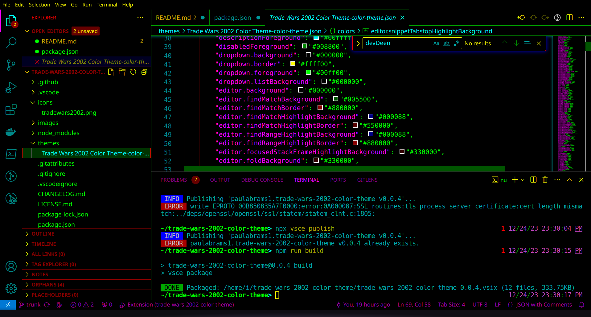

# Trade Wars 2002 Theme for VS Code

This is my interpretation of a Trade Wars 2002 theme as a VS Code extension.

To install this theme in VS Code:
Press (Ctrl+P) in VS Code to open the quick console, paste the following command, and press enter.
`ext install paulabrams1.trade-wars-2002-color-theme`

See below for how to create your own extension using this one as a starting point.

If you're reading this from github, here's the [marketplace page](https://marketplace.visualstudio.com/items?itemName=paulabrams1.trade-wars-2002-color-theme).
https://github.com/pabrams/trade-wars-2002-color-theme/blob/trunk/images/Screenshot_20231224_233149.png?raw=true
## Quickstart

images/Screenshot_20231224_233149.png
https://github.com/pabrams/trade-wars-2002-color-theme/blob/f3b789a1c09d9680b2a443f28807091241fec5bb/images/Screenshot_20231224_233149.png

* Press `F5` to open a new window with the extension loaded.

* Open `File > Preferences > Color Themes` and pick the desired color theme.

* Open a file that has a language associated. The languages' configured grammar will tokenize the text and assign 'scopes' to the tokens. To examine these scopes, invoke the `Developer: Inspect Editor Tokens and Scopes` command from the Command Palette (`Ctrl+Shift+P` or `Cmd+Shift+P` on Mac).

## Make changes

* Changes to the theme file are automatically applied to the Extension Development Host window.

## Adopt your theme to Visual Studio Code

* The token colorization is done based on standard TextMate themes. Colors are matched against one or more scopes.

To learn more about scopes and how they're used, check out the [color theme](https://code.visualstudio.com/api/extension-guides/color-theme) documentation.

## Install your extension

* To start using your extension with Visual Studio Code copy it into the `<user home>/.vscode/extensions` folder and restart Code.
* To share your extension with the world, read on https://code.visualstudio.com/docs about publishing an extension.

### From CLI

Install dependencies, then run the build script, then install the extension itself.

`npm install && npm run build && code --install-extension trade-wars-2002-color-theme-1.0.16.vsix`

### publish

`npx vsce login paulabrams1`

`npx vsce publish`

Check https://marketplace.visualstudio.com/manage/publishers/paulabrams1 and wait for it to stop verifying.

Then visit https://marketplace.visualstudio.com/items?itemName=paulabrams1.trade-wars-2002-color-theme
